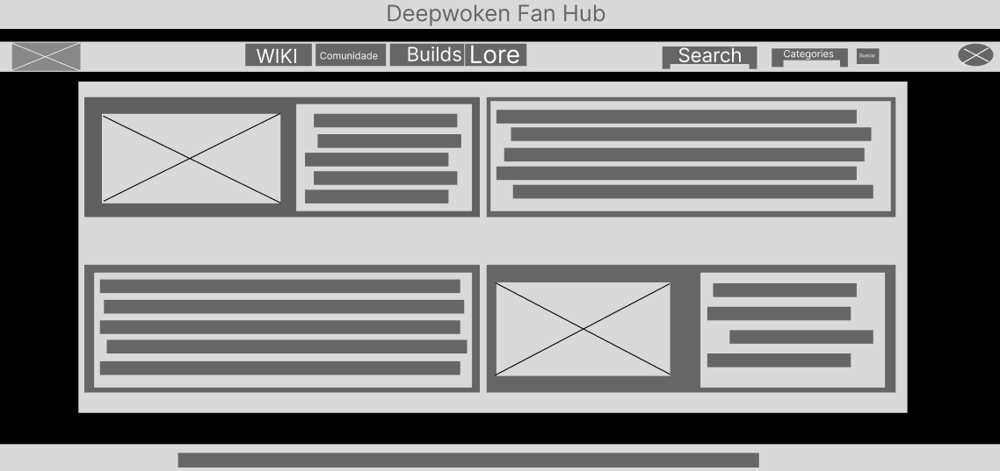
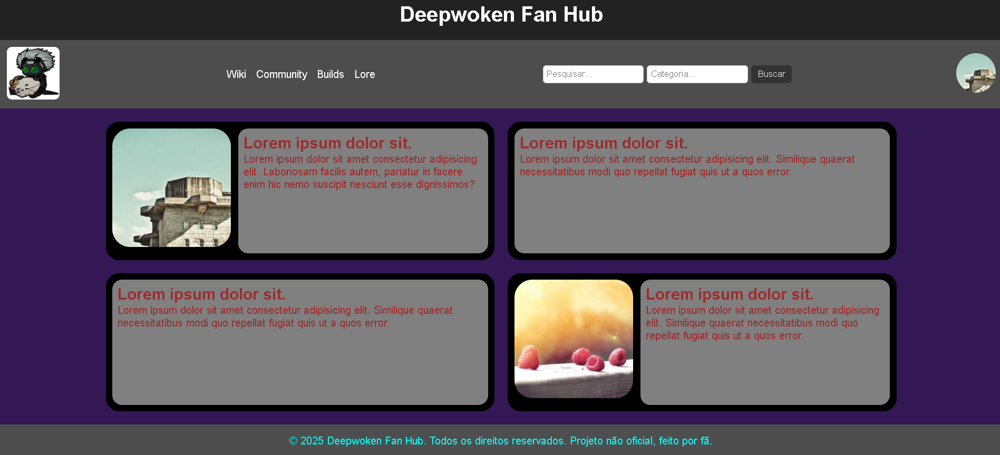

# Trabalho Prático - Semana 03

Dessa vez, vamos escolher uma proposta de projeto para trabalhar.

Nessa atividade, você deverá montar a página inicial do projeto escolhido, a organização do HTML aplicando semântica correta e uso aprimorado do CSS. Leia o enunciado completo no Canvas para mais detalhes.

**IMPORTANTE:** Você deve trabalhar e alterar apenas arquivos dentro da pasta **`public`**. Deixe todos os demais arquivos e pastas desse repositório inalterados. **PRESTE MUITA ATENÇÃO NISSO.**

## Informações Gerais

- Nome: João Pedro Lima de Andrade. 
- Matricula: 885317 
- Proposta de projeto escolhida: 5. Temas e Conteúdos Associados. 
- Breve descrição sobre seu projeto: Deepwoken Fan Hub será uma aplicação web criada para a comunidade de deepwoken,
 onde será possivel visualizar informações importantes sobre o jogo, e os jogadores 
 poderao interagir entre si de diversas maneiras.

## Print do(s) wireframe(s) criado

## Print da home-page criada

